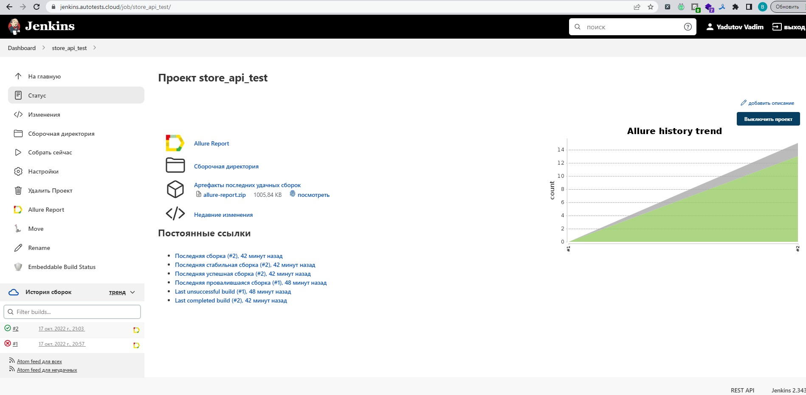
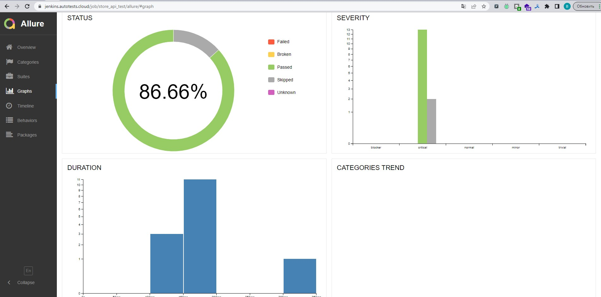
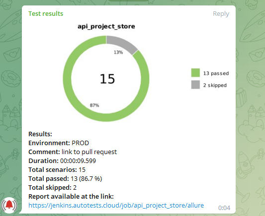

# Дипломный проект по автоматизации API тестирования для store. 
<a target="_blank" href="https://app.swaggerhub.com/apis-docs/berpress/flask-rest-api/1.0.0#/">Веб сайт store</a>

## :memo: Содержание:

- [Реализованные проверки](#boom-Реализованные-проверки)
- [Технологии](#classical_building-Технологии)
- [Сборка в Jenkins](#man_cook-Jenkins-job)
- [Запуск из терминала](#electron-Запуск-тестов-из-терминала)
- [Allure отчет](#bar_chart-Allure-отчет)
- [Allure TestOps](#Allure-TestOps)
- [Отчет в Telegram](#envelope-Уведомление-в-Telegram-при-помощи-бота)

## :boom: Реализованные проверки

- ✓ Проверка логотипа
- ✓ Проверка функции поиска по тексту
- ✓ Проверка текста ошибки на странице авторизации/регистрации
- ✓ Проверка страницы Адреса
- ✓ Проверка функции поиска по фото
- ✓ Проверка поиска через меню (бургер)

## :classical_building: Технологии

<p align="center">


</p>

## :man_cook: Jenkins job
</a>  <a target="_blank" href="https://jenkins.autotests.cloud/job/store_api_test/">Jenkins job</a>
<p align="center">
<a href="https://jenkins.autotests.cloud/job/store_api_test/"></a>
</p>

## :electron: Запуск тестов из терминала

Локальный запуск:

Create and activate virtual environments

```
python3 -m venv venv
source venv/bin/activate
```

Run in terminal

```
pip install -r requirements.txt
```

### Run all tests

```
pytest
```

## :bar_chart: Allure-отчет
</a> Отчет в <a target="_blank" href="https://jenkins.autotests.cloud/job/store_api_test/allure/#graph">Allure report</a>
<p align="center">
<a href="https://jenkins.autotests.cloud/job/store_api_test/allure/"></a>
</p>


## :envelope: Уведомление-в-Telegram-при-помощи-бота
<p align="center">
</a>
</p>